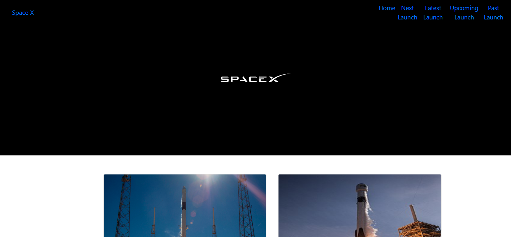

Frontend realizado com React + bootstrap para estilização das páginas

Para rodar o projeto utilizar os seguintes comandos:

## Para iniciar o ambiente de desenvolvimento
	npm start
	
Servidor rodará no http://localhost:3000

Neste projeto foi utilizado bootstrap e os arquivos CSS foram adquiridos no seguinte endereço:
##
    https://startbootstrap.com/templates/business-frontpage/

Página principal:

   

